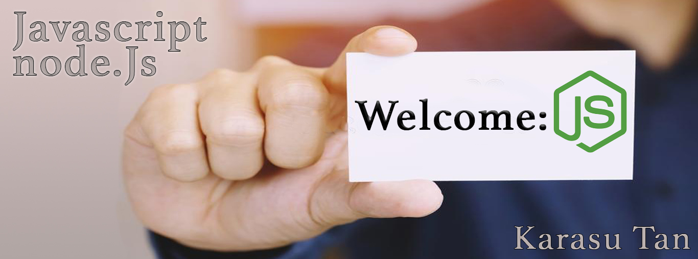

# I introduce mySelf

Welcome to my présentation dear guest. With this litte presentation I will show you my skills and my projects. I will also show you some of my hobbies and how I gain my experience. I define mySelf as a Junior developper, a self-learner and a curious person. I hope you will enjoy my presentation.

---

# Projects

In this section, I will show you some of my projects. If the code is property of company, I will not show you. I will just explain what I've done. You will have link and Code of all my personnals projects.

---

## package Redis

### Aims of the project

- We have to create a package to manage redis database.
- All of our back-end project handle a database (PostGres and/or Redis).
- This package will impact positively almost 70% of our project. 

### Before we start our package, we had some problems to solve.

- All of our project uses database without a knowledge on different part of the application about how many database we have running, what are the values in differents database and so on.

- We had to found a solution to mutualize all database in a central place. 
- In addition of that, we have difficulty to maintain the source code, difficulty to evolve.
- we had also difficulty to test our code. 
- And finally, we had to make a lot of test and documentation, on each project implementing a Redis database. 
- and last big problem was strong coupling between all part of our project using Redis Database. We need to have a solution if we want to upgrade or change our database without changing our code.

### Overview of the Redis solution

Stack:
- Redis
- NodeJs
- Typescript
- Jest

The solution is a perfect situation of the OOP paradigm.

We have add test with Jest inside our package. Each unit tests solves a specific problem on each package Redis is used. Imagine for example 15 packages are using Redis database, with one test we solves common problems on each.

Coverage is almost 90% and should be completed with Functionnal tests in the future.

The package export methods to instantiate and close connection to a Core Redis database. All features of the package use this unique connection.

### Features of the package:

- initialize a connection to the core Redis database.
- destroy the connection.
- get the connection.
- clear the database.
- a automatic, default or custom key prefixing system.
- classes and methods have different behavior depending the input they handles (string, buffer, object).
- perfom action on a string, a buffer or objects:
  - Create.
  - Read.
  - Update.
  - Delete.
- an Authentication attempt handler who check if someone try to use brute force attack:
  - check if the key is expired.
  - check the number of attempt.
  - a fail handler method.
  - a method who clear expired key.
- a random key generator.
- a method who handles the duration of the session.
- a session updater.
- an authenticated user checker/handler.
---